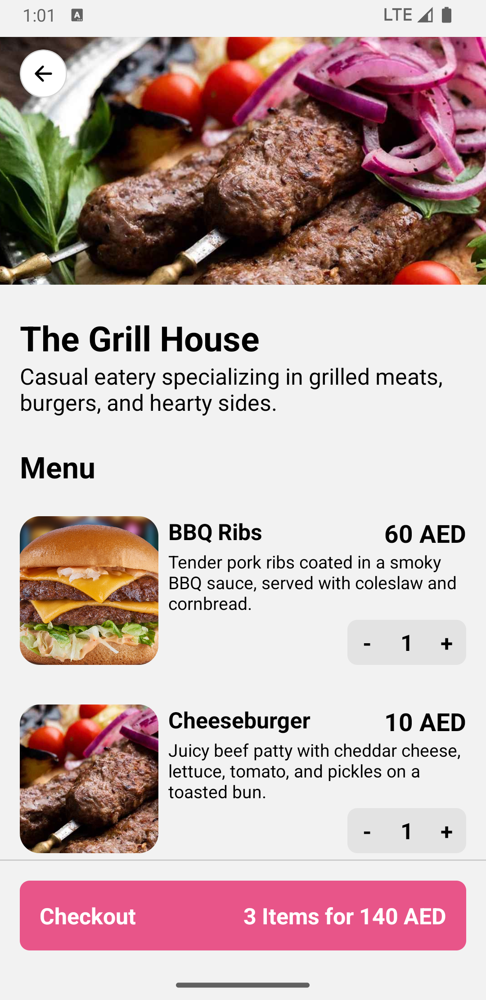

### A couple of points worth mentioning:
- Expo Go is used, so no native directories generated.
- No UI library has been used except for carousal, order placed animation, checkbox (paper). 
- Everything is expected to be loaded from a server, but timing of responses are tweaked so that it can give a better UX
- Complex adding/removing items operations are handled in outlet details screen, spamming kept in mind.
- Search operation is automatically triggered after a small delay, spamming kept in mind.
- I used the cash payment option as a requirement to unlock placing the order, this logic is placed in the model area where also other fields in a real app can be validated too instead of UI
- Static data is generated using GPT and images are downloaded from the internet.
- There is an abstraction over recurring UI states, in these cases the component `<StateHandler/>` is used to handle the generic cases.
- The Cart's end-state is expected to be saved in a back-end rather than cached locally, and the `MockedCartApi` is doing all the work that a backend should do.

